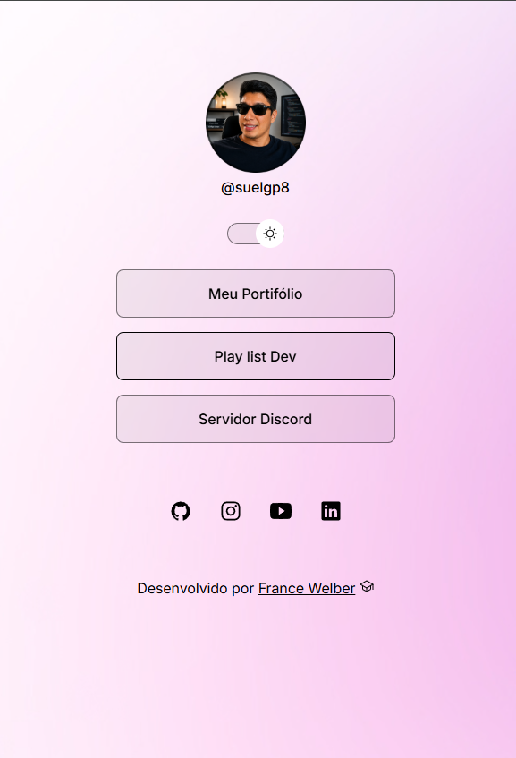
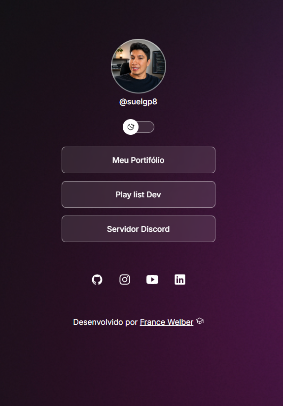

# 🔗 MyLinks Dev

Projeto inspirado no Linktree para centralizar links pessoais em um único lugar.

## 🚀 Tecnologias utilizadas

- HTML5
- CSS3
- JavaScript

## 🌐 Acesse o projeto

👉 https://suelgp8.github.io/myLinks-dev/

## 📱 Funcionalidades

- Alternância entre tema claro e escuro
- Layout responsivo (desktop e mobile)
- Links personalizados
- Interface simples e moderna

## 📸 Preview



## 🛠️ Como usar

1. Clone o repositório:

```bash
git clone https://github.com/suelgp8/myLinks-dev.git
```

2. Abra o arquivo `index.html` no navegador

## 👨‍💻 Autor

Desenvolvido por **France Welber**

- GitHub: https://github.com/suelgp8
- LinkedIn: https://www.linkedin.com/in/suelgp8

---

💡 Projeto criado para estudo e prática de desenvolvimento web.
